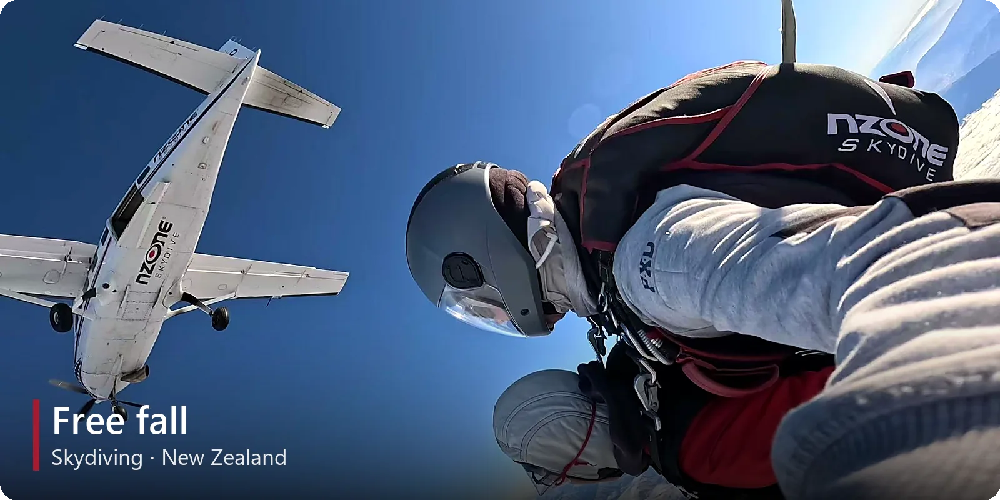
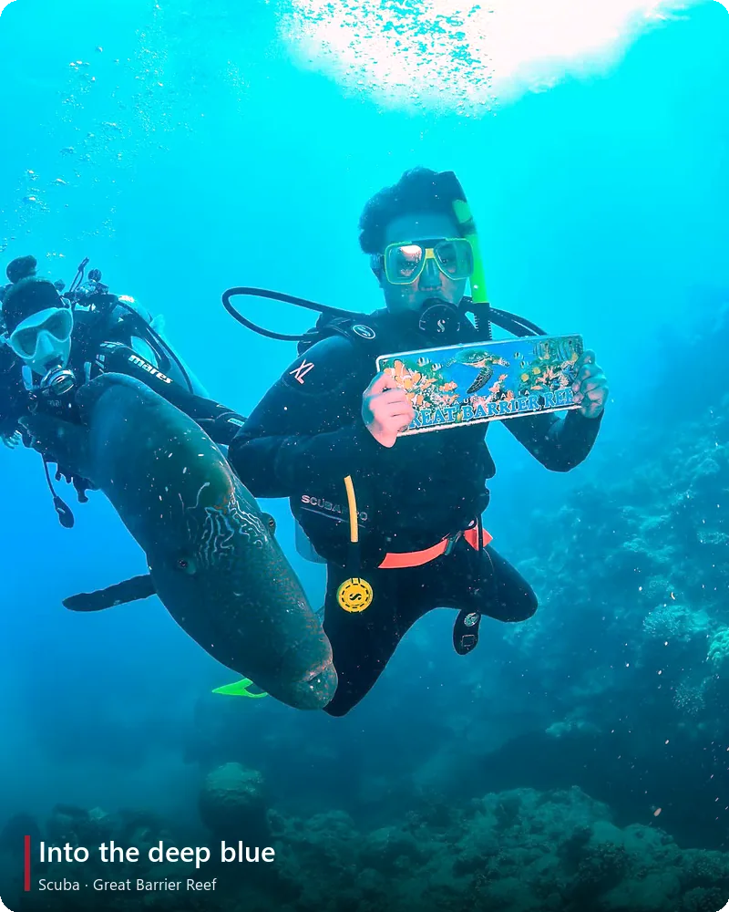
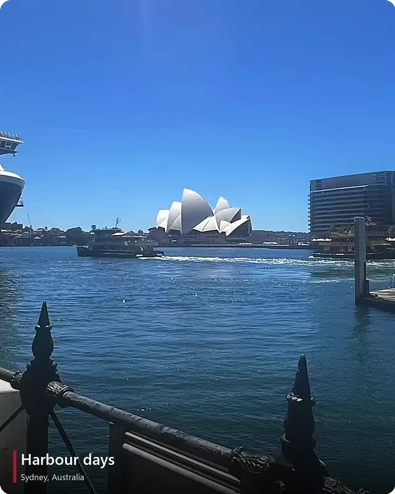

  

  

  
  
  
  

## ✨ Highlights

- 🎓 **Harvard University**, M.S. in Computational Science & Engineering
   also admitted to **Carnegie Mellon** · **Northwestern** · **UPenn**
- 🎤 **Eurographics 2026 Oral**: first-author paper *OUGS* + **EG Widening Participation Scholarship**
- 📄 **3 first-author papers in 2026**: Eurographics · CHI EA · ACM Interactive Health
- 🏅 **National Scholarship of China** (top 1%) · **Mark Edwin Hurd Memorial Prize** (1 student/year) · **ICM Finalist** (top 2%)

## 📄 Papers

- **OUGS**: Active View Selection via Object-aware Uncertainty Estimation in 3DGS · *Eurographics 2026, Oral* · [Paper](https://onlinelibrary.wiley.com/doi/abs/10.1111/cgf.70363) · [Code](https://github.com/Gatsby0916/OUGS)
- **Who Fails Where?** LLM and Human Error Patterns in Endometriosis Ultrasound Report Extraction · *CHI 2026 EA* · [Paper](https://dl.acm.org/doi/abs/10.1145/3772363.3798872)
- **EndoExtract**: Co-Designing Structured Text Extraction from Endometriosis Ultrasound Reports · *ACM IH '26* · [Paper](https://dl.acm.org/doi/10.1145/3786579.3804934)

## 🛠️ Toolbox

  

## 🌊 Beyond the Lab

  

  

  
  

  <picture>
    <source media="(prefers-color-scheme: dark)" srcset="https://raw.githubusercontent.com/Gatsby0916/Gatsby0916/output/github-snake-dark.svg"/>
    
  </picture>

